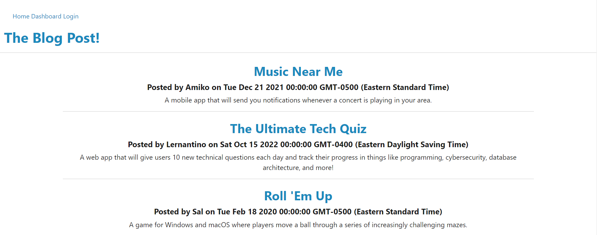

# Public-Blog-Post
## Description
The blog is a place to share one's thoughts and comments. The user can leave a comment on a blog post from another user as well as create blogs for others to see. It is a social online interaction with people around the world. 

[Go to Website here](https://hidden-river-55845-74ffbf6b4552.herokuapp.com/)

## Installation
I created a repo in GitHub, which then cloned onto VS. After having everything ready, I added the necessary folders along my coding journey.

## Usage
This application aims to connect people to share their opinions and unite everyone as a community. You can add a comment if the user clicks a blog on the homepage, create a blog in the dashboard, and update or delete the content. It is a fun way to interact with people. 

## Credits
The University of Toronto,
Ariana Vinamagua